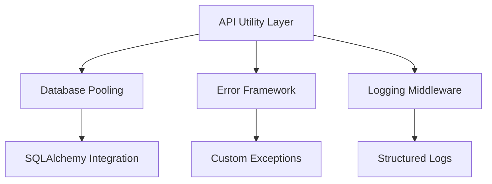
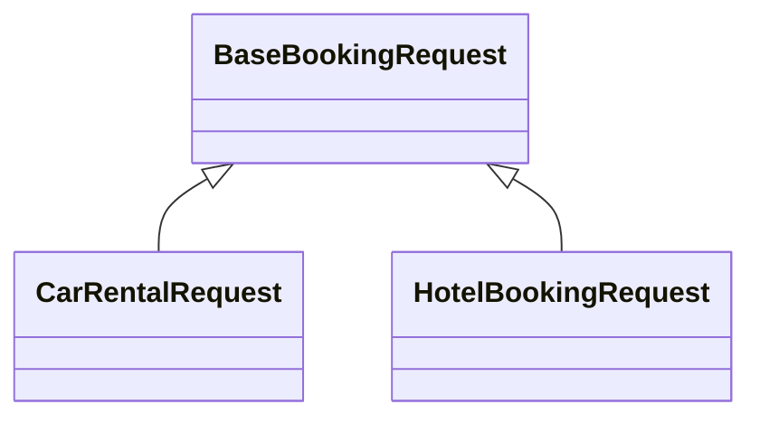
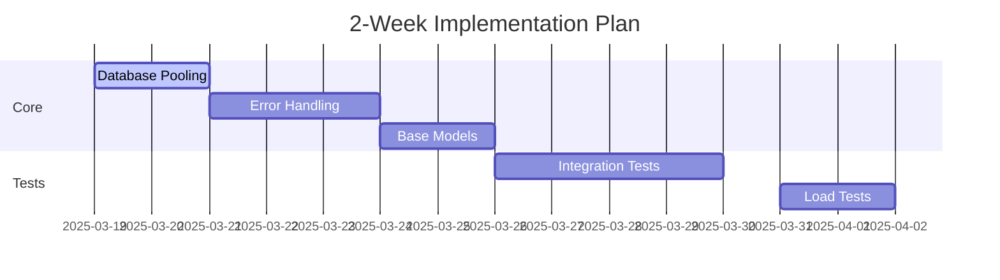

# Refactoring Plan for Core Modules

## Phase 1: API Standardization & Infrastructure Improvement


**Implementation Steps**:
1. Create `src/core/infrastructure/database.py` with connection pooling
2. Add `src/core/utils/error_handling.py` with retry decorators
3. Implement Prometheus metrics in `src/core/monitoring/`

## Phase 2: Code Restructuring


**Key Changes**:
- Consolidate 4 booking models into 1 base class
- Move business logic to `src/core/services/`
- Add async support with `anyio`

## Phase 3: Testing & Monitoring
**Test Coverage Plan**:
| Component       | Current | Target |
|-----------------|---------|--------|
| API Endpoints   | 0%      | 90%    |
| Database Layer  | 20%     | 100%   |
| Error Handling  | 10%     | 100%   |

**Monitoring Metrics**:
- API latency (95th percentile)
- Error rate by type
- Database connection pool usage

## Implementation Timeline


## Code Samples
```python
# src/core/infrastructure/database.py
from sqlalchemy import create_engine
from sqlalchemy.orm import sessionmaker

engine = create_engine(
    "sqlite:///travel2.sqlite",
    pool_size=10,
    max_overflow=20,
    pool_recycle=3600
)

SessionLocal = sessionmaker(bind=engine)
```

```python
# src/core/utils/error_handling.py
from tenacity import retry, stop_after_attempt, wait_exponential

def db_retry(func):
    return retry(
        stop=stop_after_attempt(3),
        wait=wait_exponential(multiplier=1, max=10),
        reraise=True
    )(func)